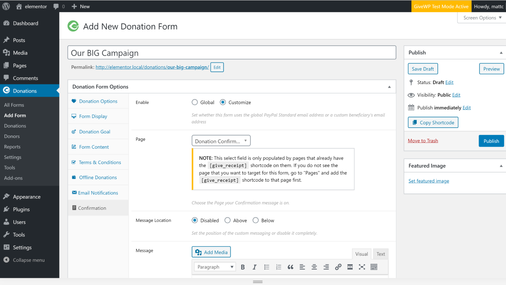
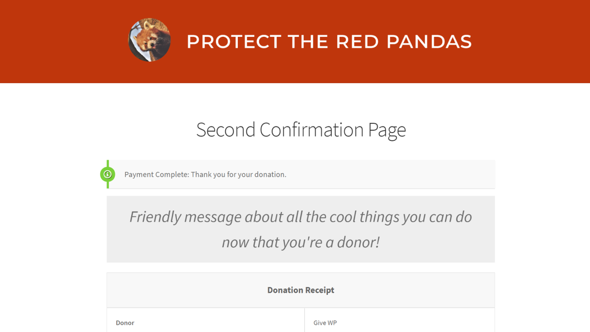

# PER FORM CONFIRMATIONS FOR GIVEWP
A [GiveWP](https://givewp.com) add-on that let's you designate unique confirmation pages per form. Useful for multilingual sites or customizing your thank you messaging.

"Per Form Confirmations for GiveWP" let's you designate unique confirmation pages per form in the GiveWP plugin. This let's you customize your "thank you" messaging per form. It is also very helpful for sites that use WPML to support multiple languages, since they have to designate a unique confirmation page per language, per form.

This has many potential use-cases. Here's a few ideas:

* Customize the look/feel of a thank you page to match the form your donors come from
* Add unique custo messaging above or below your receipt table on a per form basis.
* Helpful for sites using WPML to support multiple languages since they have to designate a unique confirmation page per language per form. 

## FEATURES

* No global settings, only per-form settings 
* Easy select dropdown of your existing page that have the `[give_receipt]` shortcode on them. 
* BONUS: Add custom messaging above or below your receipt table

## BASIC USAGE

Once enabled, all you need to do is:
1. Add a new confirmation page and include the `[give_receipt]` shortcode in it. 
2. Go to edit your form and navigate to the "Confirmation" tab. 
3. Choose your new confirmation page 
4. You can additionally add content before or afer the receipt table. This is useful if you are sending multiple forms to the same page, but still want customized messaging. 

## SCREENSHOTS

*Configure your Per Form Confirmation page and custom messaging here:

*The Gift Title and Download link as seen on the Donation Confirmation page*

## ABOUT GIVEWP
[GiveWP](https://wordpress.org/plugins/give) is the leading Donation Plugin for WordPress. Within one year Give received [over 350 5-star reviews](https://wordpress.org/support/view/plugin-reviews/give), and 70,000 active installs. GiveWP is actively developed and supported. Find out more at [givewp.com](https://givewp.com). Read about our [Give Stories here](https://givewp.com/category/give-stories).